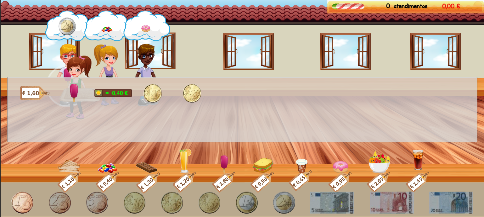
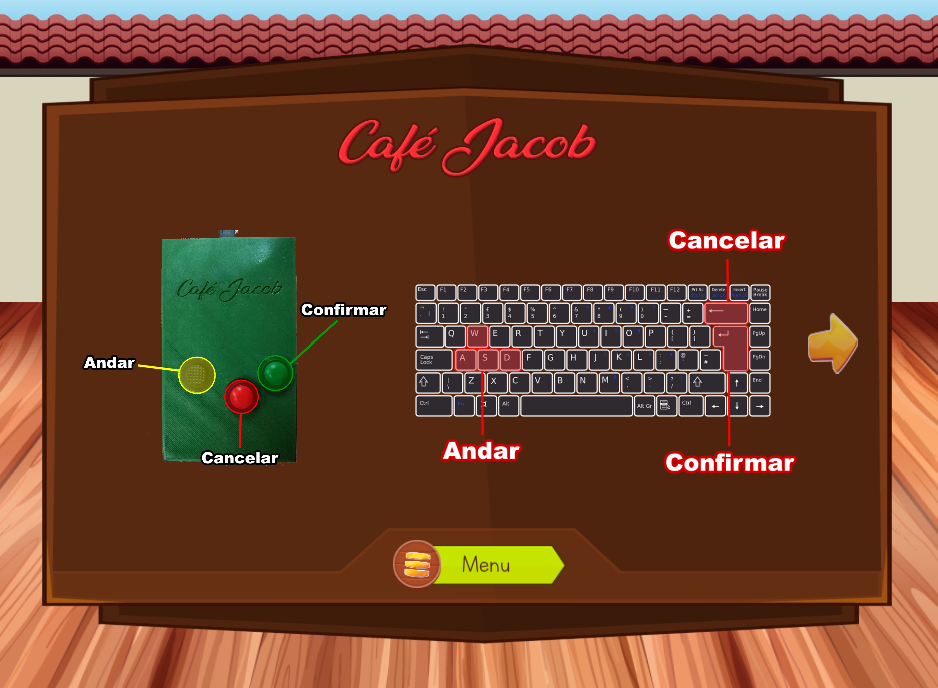
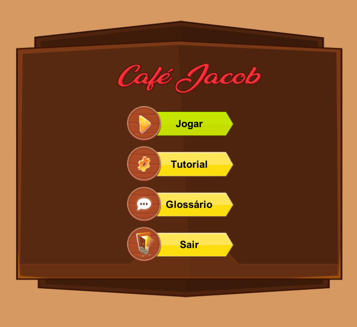
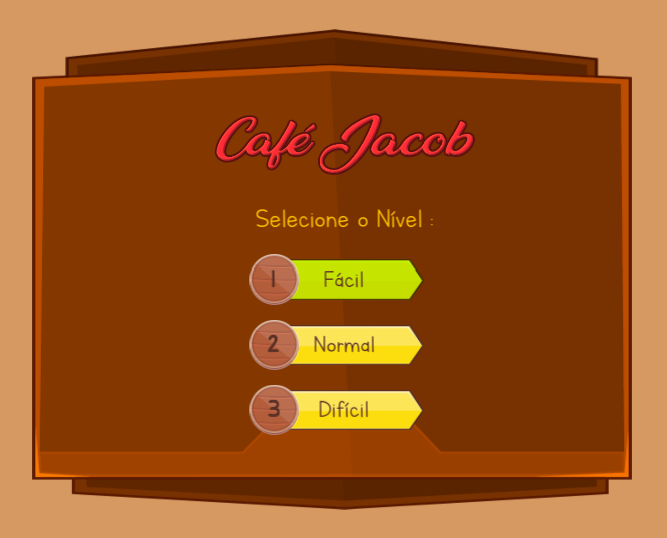
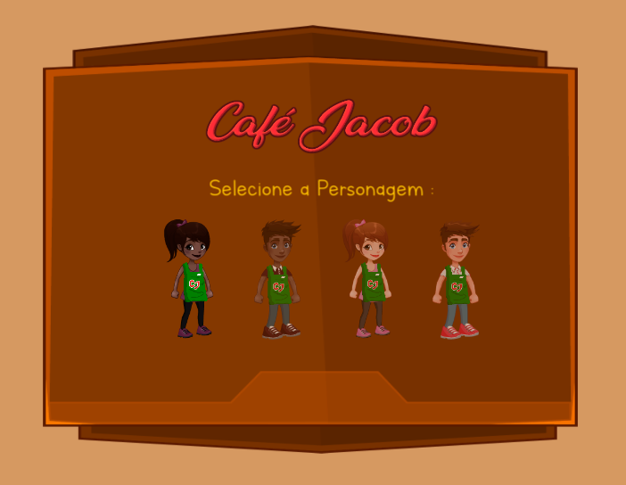
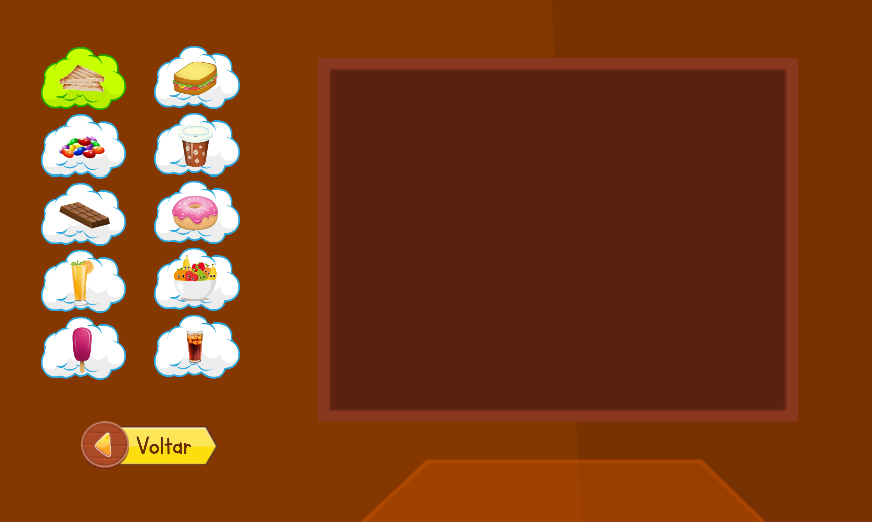

# 2D Cafe Game

Built using Unity Engine (C#)

   **Graphics not included**
  - Premium licensed graphics from Freepik, not included.
  - Some UI graphics from free asset store packages, not included.

   **Project Context**

   Class project submitted during graduation course at __Universidade Lusofona - ULHT__. 

   Project developed partnering with a **school for kids with hearing disabilities**. During planning phase, one of the needs expressed by the partners was that the students found it was a chalenge to ___learn how to use cash___. 

   Kids would sometimes bring cash to buy snacks during break time, but could not yet transfer knowledge of math to the "real world" of coins and bills where *10* can be worth less than *5* or *2*.
   
   Understanding how a **10 cents** coin is worth less than a **2 euros** coin or a **5 euros** bill was not as straight forward, so we presented this game as a means for making things more visual. Game mechanics includes serving clients a snack and selecting the correct change at checkout.

  Integrated with the project was an external console built with a 3d printer and Arduino components, as seen below (the green gadget pictured on the left)

  

   **Code Features**

Originally coded for **Unity version 2017.x**. Might not follow the most current practices and features of the engine.

I was surprised **Unity version 2020.3** actually was able to restore this one and game is still working all right. 

When using this project scripts for your own game, you would need to replace missing graphics and possibly edit to exclude some of the extra resources I had on the scenes, though.

- Game Menu
- Tutorial screen
- Glossary screen (selecting food icon on the left would load a corresponding video on the right (*video not included*). Video was sign language for identifying the selected food)
- High scores
- 3 game levels (changing day speed timer)
- Character selection screen
- Player must pick the products ordered and serve clients
- NPCs spawning, walking, ordering random products

- **"Realistic" payment system:**
  - Clients (non-playing-characters) pay with coins/bills worth a little over the price for the purchased product.
  - Player must identify how much each coin/bill is worth
  - Player must select whatever combination of coins and notes for summing up the right change to give the client
  - Checkout UI overlay:
    - Shows product tag with numerical price
    - Shows product icon
    - Shows player's selected coins and bills with the numeric sum of their values:
        - red colored while change is not right
        - green colored once the player selects the right amount of cash for change.

  

  

  

  
